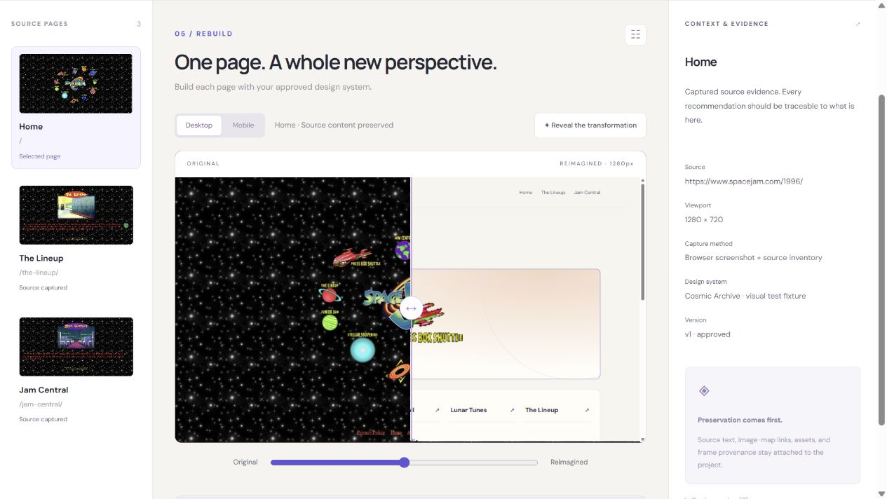
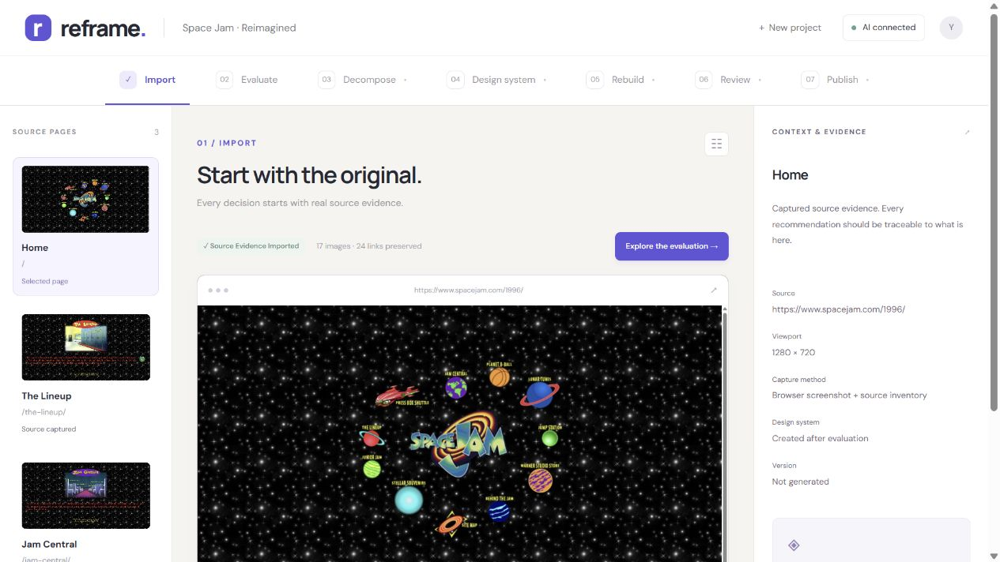
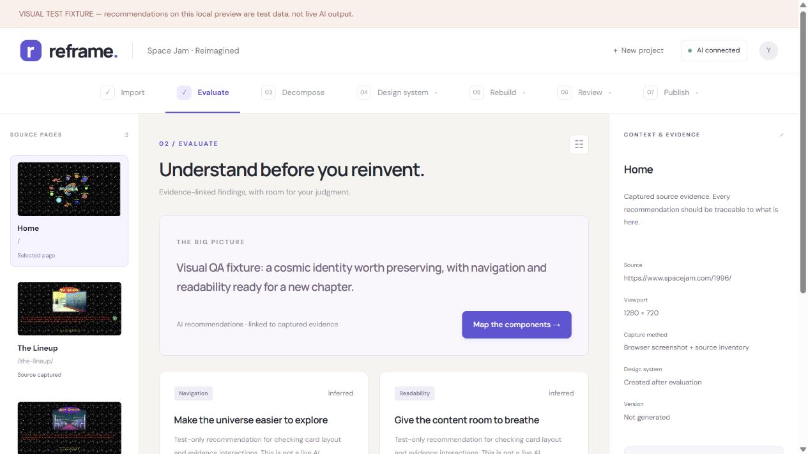
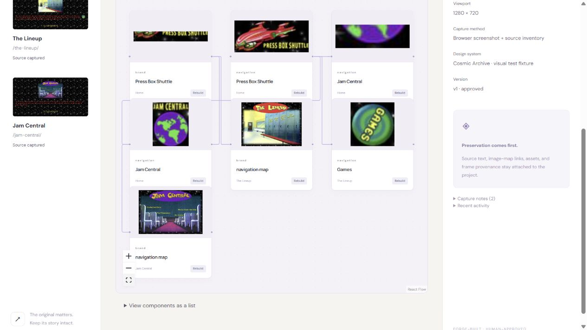
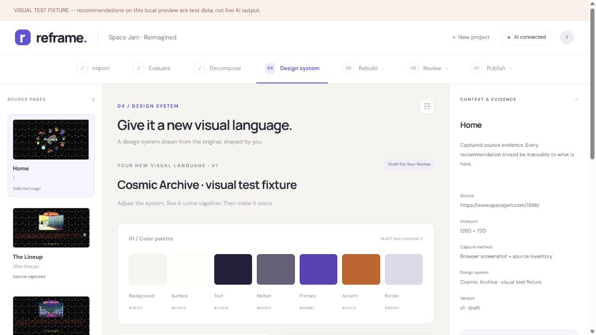
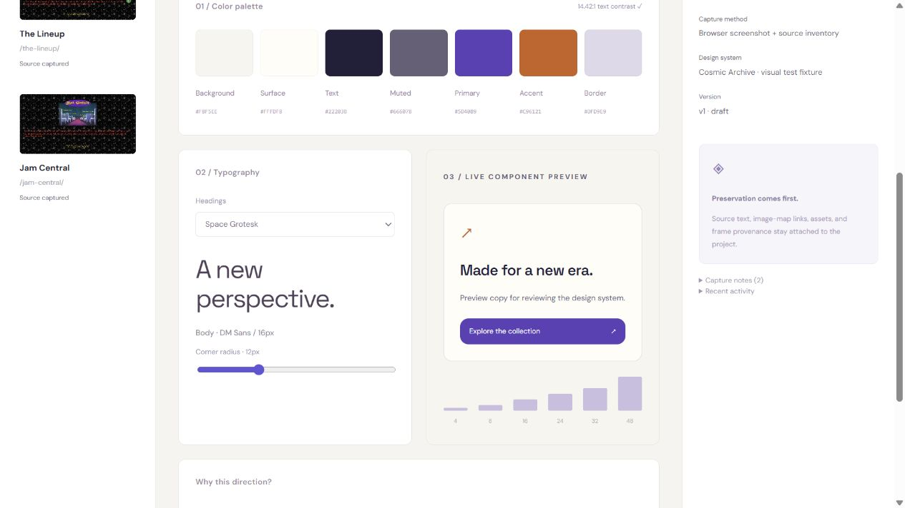
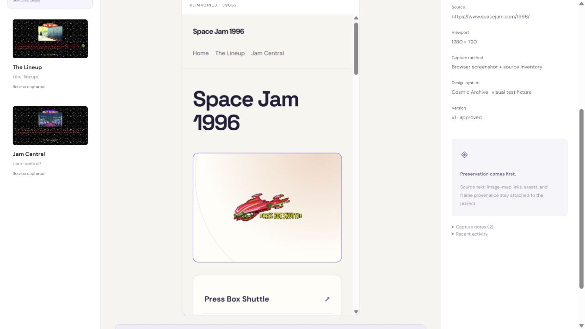

# Reframe

**Turn a legacy static website into a reviewed design system and a modern static site.**

Reframe is an open-source UI modernization workbench. It keeps source evidence, AI recommendations, design decisions, and page approvals together so a redesign can be reviewed before publication.

### Compare the original with the next version



**Drag the comparison slider in the app to reveal the transformation.** Review the source and rebuilt page together before approving it. This screenshot shows the slider at its midpoint.

The visual tour uses the Space Jam reference study. Recommendation and redesign screens show **sample data from the local visual test fixture**, not a verified live AI result. Screenshots are static; click an image to inspect it at full size. [Capture details and content rights](docs/images/README.md).

## What it does

1. **Import evidence:** load a prepared ZIP containing source HTML, screenshots, text, links, assets, and provenance.
2. **Evaluate the site:** request evidence-based findings from OpenAI.
3. **Map components:** inspect screenshot regions on a visual canvas, correct component descriptions, and save the board.
4. **Create a design system:** generate site-specific colors, typography, spacing, and component recommendations; edit and explicitly approve them.
5. **Rebuild page by page:** generate structured page specifications, compare source and output at desktop and mobile sizes, and approve each page.
6. **Publish static output:** freeze approved versions into an immutable release, serve it through a separate read-only service, and download the matching ZIP.

Approval gates run on the server. Changing a design or page requires current approvals before publication. Imported legacy scripts are never executed by the renderer.

## A visual tour

| Start with evidence | Understand what needs to change |
| --- | --- |
| [](docs/images/source-evidence.jpg) | [](docs/images/evaluation.jpg) |
| **Source evidence.** Keep screenshots, original content, links, and capture provenance together. | **Evaluation.** Review findings about navigation, readability, and preservation alongside their source. |

| Break the interface into components | Shape a site-specific design system |
| --- | --- |
| [](docs/images/component-board.jpg) | [](docs/images/design-system.jpg) |
| **Component board.** Explore source regions, reusable groups, and editable component descriptions on a draggable canvas. | **Design direction.** Review and adjust the proposed palette before approving a design-system version. |

| Preview the design before rebuilding | Review each page on smaller screens |
| --- | --- |
| [](docs/images/design-preview.jpg) | [](docs/images/mobile-preview.jpg) |
| **Live design previews.** See typography, corner radius, spacing, and component styling together. | **Mobile review.** Inspect the rebuilt page at 390px as well as desktop size before page approval. |

After design and page approvals, Reframe packages the reviewed pages into a static release and matching ZIP. See [publication setup](#try-publication-locally) to run that step yourself.

## Use cases

- Review a small static-site redesign with a designer or client before implementation.
- Explore a new visual direction while retaining original copy, links, and image provenance.
- Build an internal modernization workflow with explicit human checkpoints.
- Study or extend evidence-based AI generation, versioned approvals, and deterministic static rendering.

Reframe is an early working prototype for small static sites. It does not migrate application logic, databases, interactive forms, or arbitrary JavaScript applications. It accepts evidence bundles; it does not crawl a URL for you.

## Run locally

Requires Node.js **22.14 or newer**, npm, and a platform supported by Miniflare. No cloud account is required for local storage. Live recommendations require your own OpenAI API account.

```sh
git clone https://github.com/Yoha02/reframe-ui-modernization.git
cd reframe-ui-modernization
npm ci
npm run build
npm run dev:worker
```

Open **http://127.0.0.1:8787**. Local authoring is enabled only on loopback; project data persists under the ignored `.wrangler/` directory. You can import and inspect evidence without an API key. Live generation stays disabled until both a key and a positive budget are configured.

To enable AI, copy `.env.example` to `.env`, fill in `OPENAI_API_KEY` and `OPENAI_BUDGET_USD`, then restart the local Worker. The supported models are `gpt-4.1-mini-2025-04-14` (default) and `gpt-4.1-mini`.

**Keep the API key on the server.** `.env` is ignored. Never put keys in source, screenshots, browser storage, `VITE_*` variables, or a deployed frontend. The application budget uses request reservations; it is not an account-wide billing guarantee. Configure and monitor provider-side usage controls separately.

For frontend development, leave the Worker running and run `npm run dev` in another terminal. Vite proxies API requests to the Worker. Rebuild and restart the Worker after backend changes.

### Try publication locally

Set `RELEASE_ORIGIN=http://127.0.0.1:8788` and a random `RELEASE_PUBLISH_SECRET` of at least 32 characters in `.env`. Restart the workbench, then run in a second terminal:

```sh
npm run build:releases
npm run dev:releases
```

The release service loads only the publishing secret, not the OpenAI key. After design and page approvals, publication creates a local URL and ZIP. Local URLs are only accessible on your computer; follow the [deployment instructions](docs/sites-deployment.md) for public hosting.

## Bring your own site

Capture content you own or have permission to use. Package it according to the [evidence-bundle guide](docs/evidence-bundles.md), then import it in the workbench. Current limits: **3 pages, 20 MB compressed, 60 MB expanded, 500 files**, and 10 MB per file.

A bundled Space Jam 1996 reference study demonstrates legacy image maps and frames. Its original content, artwork, and screenshots are third-party material, **not MIT-licensed Reframe assets**. Read the [third-party notices](THIRD_PARTY_NOTICES.md) before reusing or publishing them. The importer and generation pipeline are shared across all sites.

## Architecture

| Part | Implementation |
| --- | --- |
| Workbench | React, TypeScript, React Flow, Vite |
| Authoring API | TypeScript Worker, validated requests, signed sessions and CSRF protection |
| Persistence | D1 for workflow state; R2 for evidence and generated files |
| Generation | Backend OpenAI Responses API, structured outputs, validation and saved runs |
| Rendering | Validated page specifications rendered into static HTML/CSS |
| Publication | Separate Worker and R2 storage; authenticated ingestion, public read-only artifacts |

`src/shared/schemas/` defines the contracts. `src/worker/` implements the workflow. `src/release-worker/` serves releases. `migrations/` contains the database schema.

Hosted authoring currently depends on the Sites authenticated identity gateway and an email allowlist. All allowlisted authors share the workspace; this is not tenant-isolated SaaS. Another host needs a proper authentication adapter before public deployment. See [SECURITY.md](SECURITY.md).

## Status and limitations

Automated tests cover imports, validation, approvals, stale versions, content preservation, sessions, rendering, and release verification. Model tests use mocked responses; a live model-generated end-to-end publication has not yet been verified. Storage, authenticated import, and independent static hosting have been exercised separately.

There is no automatic recovery for interrupted generation jobs, and regeneration/version-management UX remains limited. Canvas edits require an explicit save. Model findings are recommendations, not an accessibility audit or performance measurement. Review generated pages and content before publishing.

## Contribute and reuse

Fork the repository, follow the local setup, and submit a pull request. Start with [CONTRIBUTING.md](CONTRIBUTING.md) and the [workflow requirements](docs/product-requirements.md).

```sh
npm run typecheck
npm run lint
npm test
npm run build
npm run build:releases
```

Reframe's original code and documentation use the [MIT License](LICENSE): you may use, modify, distribute, and sell copies while retaining the license notice. Third-party content and dependencies retain their own terms; see [THIRD_PARTY_NOTICES.md](THIRD_PARTY_NOTICES.md). Your fork uses your own credentials, infrastructure, and content rights.
